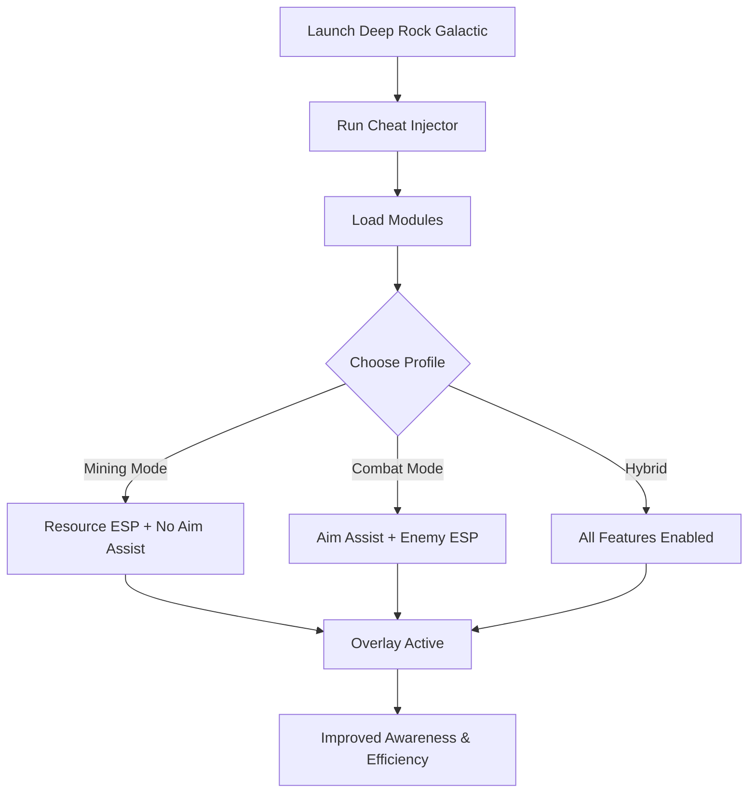

# Deep Rock Galactic Cheat Tool ⛏️

In **Deep Rock Galactic**, dwarves face endless caves, hordes of alien swarms, and rare minerals hidden deep underground. Between chaotic combat and resource farming, survival can be overwhelming. The **Deep Rock Galactic Cheat Tool** helps you stay ahead with **ESP overlays, aim assist, and resource scanners**, all optimized for PC.

---

## 🌐 Overview

This isn’t just a basic cheat—it’s a **multifunctional enhancement tool**. Whether you’re mining Nitra, hunting rare gems, or battling waves of Glyphids, you can toggle **ESP highlights, targeting assist, and loot filters** instantly. Configurable profiles make it easy to adapt to mining runs, boss fights, or defensive missions.

---

## 🔑 Features

* 👁 **ESP Overlay** – Spot enemies, teammates, and minerals through terrain.
* 🎯 **Aim Assist** – Configurable FOV, smoothness, and lock-on zones for firearms.
* 💎 **Resource ESP** – Highlight ores, gems, and mission-critical items.
* ⚡ **Recoil Manager** – Stabilize weapon spread for accuracy.
* 🗂 **Profile Loader** – Save builds for mining, combat, or exploration.
* ⌨️ **Hotkey Switching** – Enable or disable features in real time.
* 🔒 **Stealth Injection** – Lightweight and low-detection system.

---

[](#)
[](#)
[](#)
[](#)

---

## 🖥 Compatibility

| Platform       | Status        | Notes                         |
| -------------- | ------------- | ----------------------------- |
| Windows 10     | ✅ Supported   | Stable cheat builds           |
| Windows 11     | ✅ Optimized   | Best performance              |
| Linux (Proton) | ⚠️ Partial    | ESP works, aim assist limited |
| macOS          | ❌ Unsupported | VM-only workaround            |

\[!NOTE]
The cheat is **best supported on Windows 10/11 with DirectX**.


---

## ⚙️ Setup Guide

1. Download the Deep Rock Galactic Cheat package.

2. Extract files into a secure folder.

3. Launch Deep Rock Galactic.

4. Run the injector as administrator:

   ```bash
   drg_cheat.exe -game deeprock.exe -mode stealth
   ```

5. Edit your `config.ini`:

   ```ini
   [AimAssist]
   FOV=85
   Smoothness=6
   Target=Chest
   Hotkey=CapsLock

   [ESP]
   Enemies=True
   Teammates=True
   Resources=True
   EnemyColor=Red
   TeammateColor=Blue
   ResourceColor=Green
   ```

6. Open or close the overlay with `Insert`.

\[!IMPORTANT]
Always inject **after the game has loaded** for stability.

---

## 📊 Cheat Workflow



---

## 🎚 Example Configurations

**Mining Profile:**

```ini
Enemies=False
Resources=True
ResourceColor=Yellow
```

**Combat Profile:**

```ini
Enemies=True
Smoothness=7
FOV=90
Target=Head
```

**Hybrid Profile:**

```ini
Enemies=True
Resources=True
Teammates=True
```

\[!WARNING]
Running every ESP module at once can clutter visuals—use focused configs for clarity.

---

## ❓ FAQ

**Q: Does this cheat reduce FPS?**
A: No, it’s lightweight and optimized (<3% frame cost).

**Q: Can I switch modes mid-mission?**
A: Yes, hotkeys let you swap instantly.

**Q: Is it compatible with controller input?**
A: Limited—optimized for mouse/keyboard.

**Q: How often is it updated?**
A: Updates follow DRG patch cycles.

**Q: Is stealth injection fully safe?**
A: It minimizes detection but no cheat is 100% undetectable.

---

## 🚀 Final Thoughts

The **Deep Rock Galactic Cheat Tool** combines **ESP overlays, aim assist, and resource ESP** for a complete edge in mining expeditions and swarm defense. Built for Windows PC players, it ensures precision and awareness in every cave.

[](#)
[](#)
[](#)

---

